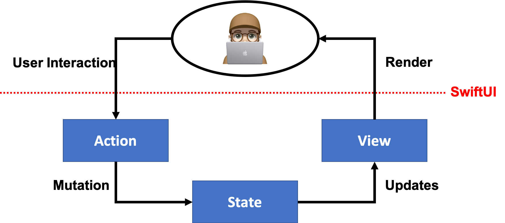
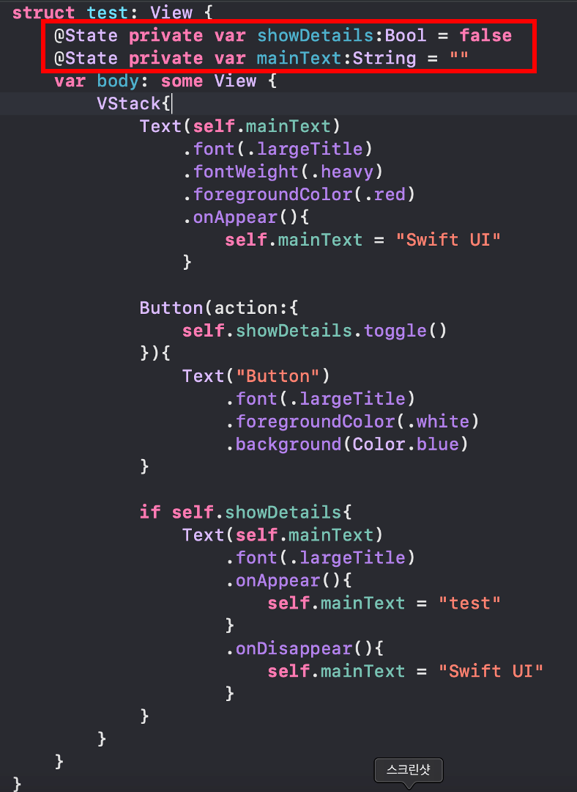
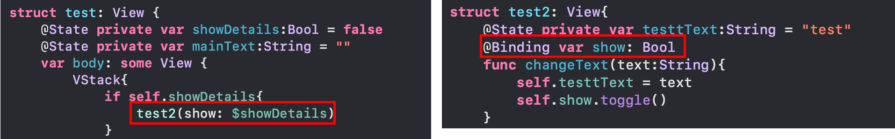
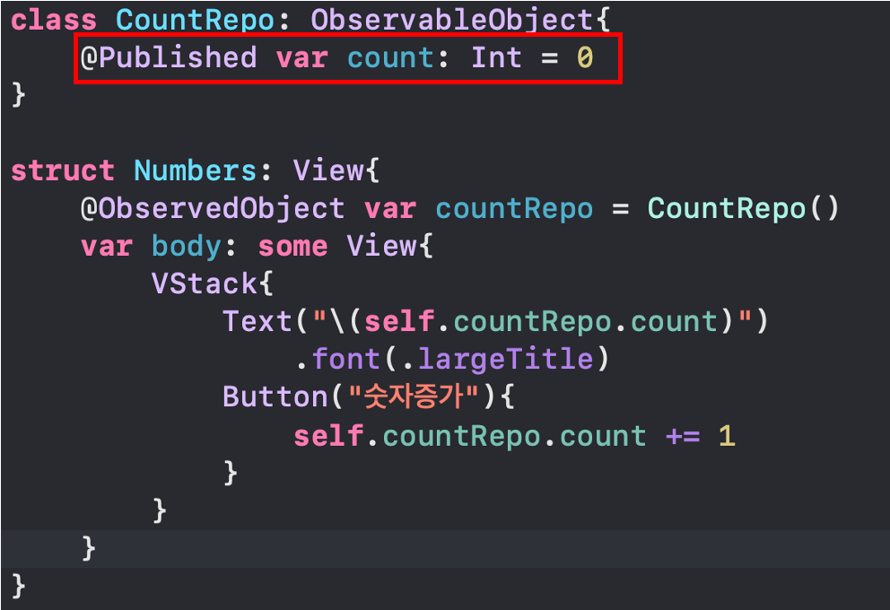
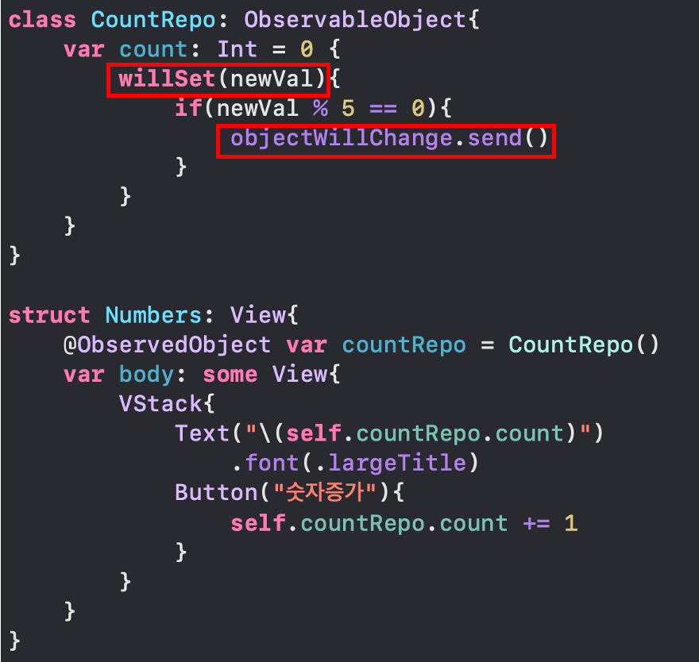
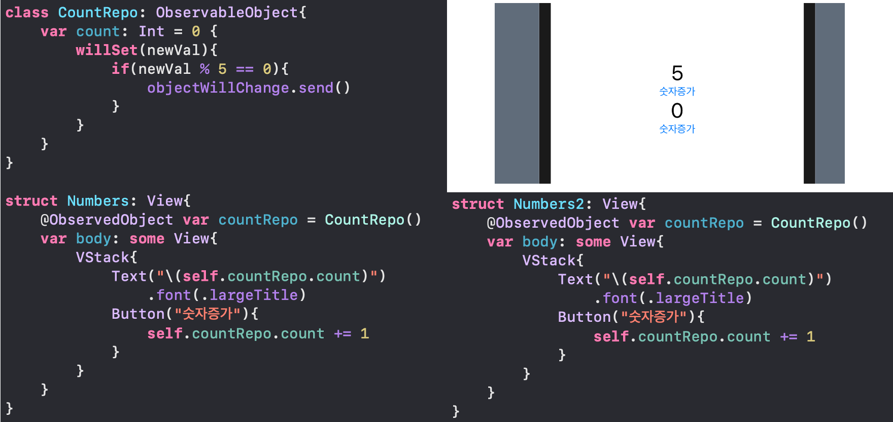
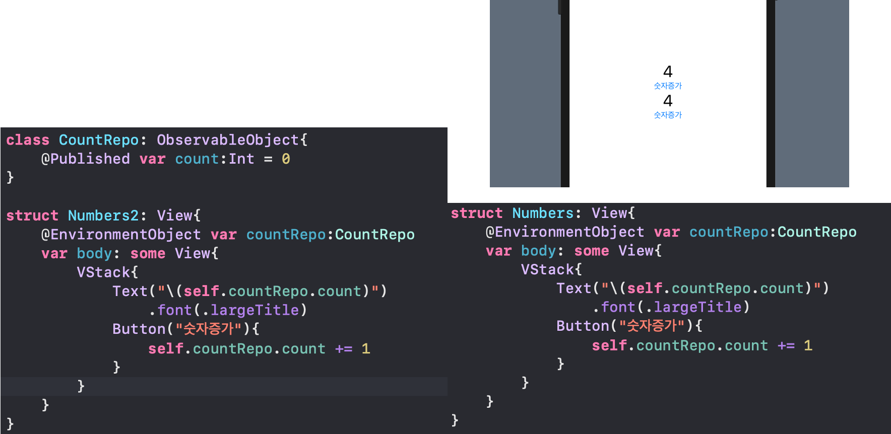

# SwiftUI

- 2019년 6월 WWDC2019에서 Apple이 공개
- Declarative(선언적)프로그래밍 방식
- 기존의 StoryBoard를 대체하는 Framework
- Swift 언어만으로 작성되는 UI Framework
## Better apps. Less Code

# 개발환경
- macOSX 10.15+ Catalina 이상 지원
- XCode 11이상 지원
- iOS, iPadOS13 이상 지원
- watchOS6, tvOS13 이상 지원

# Declarative(선언적) 프로그래밍
## Imperative Programming
- 명령형 프로그래밍
- How
- 프로그래밍의 상태와 상태를 변경시키는 구문의 관점에서 연산을 설명하는 프로그래밍 패러다임의 일종.
- 알고리즘을 명시하고 목표를 명시하지 않는다.
- C, C++, JAVA 등과 같은 언어

## Declarative Programming
- 선언형 프로그래밍
- What
- 프로그램이 어떤 방법으로 해야하는지를 나타내기보다 무엇과 같은지를 설명하는 프로그래밍 패러다임의 일종
- 알고리즘을 명시하지 않고 목표를 명시한다.
- SQL, jQuery, HTML 등


# SwiftUI Data Flow

# Life Cycle
- 각 요소마다 단 두가지의 Life Cycle이 존재한다.
- 생성될 때의 Life Cycle = onAppear(){ action }
- 사라질 때의 Life Cycle = onDisappear(){ action }

```swift
struct ContentView: View{
    @State private var mainText:String = ""
    @State private var showDetails:Bool = false
    
    var body: some View{
        VStack{
            Button(action:{
                selft.showDetails.toggle()
            }){
                Text("Button")
            }

            if self.showDetails{
                Text(self.mainText)
                .onAppear(){
                    self.mainText = "test"
                }
                .onDisappear(){
                    self.mainText = "Swfit UI"
                }
            }
        }
    }
}
```

# Property Wrapper
- Annotation을 활용하여 Wrapping 되어있는 값을 사용하는 개념
- @State
- @Binding
- @ObservedObject
- @EnvironmentObject

    ## @State
    - 지속적으로 변경 가능한 데이터
    - 단순한 데이터 ex) Bool, Int, String
    - 단일 View
    - 외부 View에서 접근 불가.
    - $State처럼 $를 붙이면 WrapperValue 자체를 전달 가능
    


    ## @Binding
    - $State에서 받은 WrapperValue를 외부 View에서 그대로 사용 가능.
    - Toggle 유무와 같은 UI 상태 값과 같은 아주 한정된 용도로 사용권장.
    

    ## @ObservedObject, ObservableObject, Published
    - ObservableObject 프로토콜을 상속받아서 사용
    - 복잡한 구조의 데이터
    - 여러 View에서 공통으로 사용되는 데이터에 적합
    - 선언한 View마다 각각의 Object를 할당하여 각 View마다 값이 있음.
    - Published Annotation을 통해 값이 변동되었을 때 바로 View에게 즉각적으로 알려준다.
    
    - @Published로 인해 count가 변할 때 Numbers의 @ObservedObject countRepo가 즉각 반응한다.
    - 만약 @Published가 없다면?
      - count 값은 변하지만 View에는 반응이 없다.
    
    
    - Property Observer로 값이 변경된 직후인 didSet, 변경되기 직전인 willSet이 존재한다.

    - 이러한 Observer를 통해 변화를 감지하고 특정 조건에 objectWillChange.send()로 @ObservedObject에 변화 값을 전달한다.
    
    


    ## @EnvironmentObject
    - ObservedObject와 달리 앱 전체에서 공유될 Share Date 이다.
    - 모든 View들이 동일한 Model을 본다.
    - 하나의 특정한 View가 해당 Model을 바꾸면 나머지 View들에도 즉시 업데이트가 된다.
    - Sync가 필요한 데이터들에 적합하다.
    